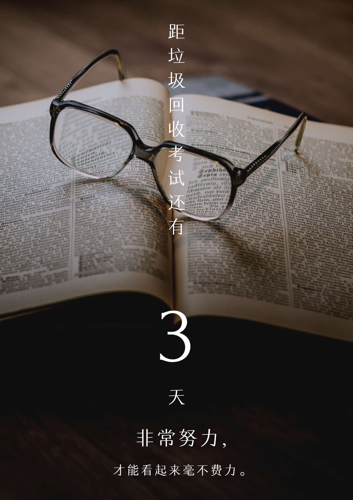

# GarbageCollection

一句话介绍: 收集垃圾回收的相关内容以及奇思妙想.

1. 背景介绍

   最近几日,我国上海地区人民喜迎垃圾回收新政,垃圾回收逐渐成为广大人民群众喜闻乐见的一种娱乐活动.诸多吃瓜群众积极围观并出言献策,其中不乏一些幽默人士创造出了诸多生动,形象的作品.本着记录生活,娱乐大家的奉献精神,特在此收集一些内容,供大家自由玩赏.

2. 微博内容

   注意!!!下表中内容一栏的所有信息均来自公开发表的微博,此处仅做截图转载并附有网址链接,所有引用内容皆在传播各种声音,并不代表本仓库作者认同或反对其观点.一句话随想只代表本仓库作者个人观点,如有任何冒犯他人之处,请通知我删除.

   | 用户                                                         | 内容                                                         | 一句话随想                            |
   | ------------------------------------------------------------ | ------------------------------------------------------------ | ------------------------------------- |
   | [欧阳志刚逐梦演艺圈](https://weibo.com/u/6444741998?is_hot=1) | [6月26日 18:02](https://weibo.com/6444741998/HAI64wr1a?from=page_1005056444741998_profile&wvr=6&mod=weibotime)   | 这个剧本,我看行!                      |
   | [史炎nacl](https://weibo.com/u/1452977132)                   | [6月26日 14:16](https://weibo.com/1452977132/HAGCc4sgF?from=page_1005051452977132_profile&wvr=6&mod=weibotime) | 评论区很精彩, 请上海周围群众小心谨慎. |

3. 衍生内容

   1. 海报(注意!!!海报中所用图片素材均来自网络,如有侵权,请告知删除)

      

      作者感言:这个海报是因为在和 [Cugtyt](https://github.com/Cugtyt) 聊到垃圾分类有些复杂,为了准确评估大家的垃圾分类掌握情况,考试必将成为一个行之有效的手段,恰逢今天距离2019年7月1日上海市垃圾分类立法正式实施还有三天,就有了以上的海报.

      

      作者感言:在有了考试制度之后,那么势必出现成绩优秀的人和成绩一般的人.我坚信,有考试的地方,必有补习班的存在!那么这个时候,如何将垃圾回收补习班做出特色,做出水平,形成差异化竞争,将会是各大辅导机构以及某些热爱教育的大V们费心费力之事.对了,年龄段要做区分啊,恩,因材施教.

      

      作者感言:如果垃圾回收考试有一定难度,使得某些不善于垃圾分类的家伙一而再再而三的挂科,或者一些人的时间非常有限(例如我等996社畜),实在不方便去做垃圾分类,亦或是自己就是不想做垃圾分类的人,都可以通过一些"非法"手段,将自己未分类的垃圾打包给垃圾回收"团伙",让专业人士去做专业的事情,我们就按时缴纳茶水钱.

      

      作者感言:当然,有犯罪的地方,就有法律的制裁.

      

      作者感言:擦亮双眼，分清垃圾的类.

   2. 宣传故事

   3. 其它随想

      

   ### 未完待续......

   ### 欢迎大家参与讨论和提交内容
